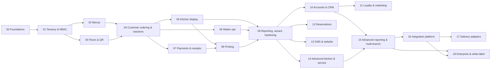

# QR Restaurant Ordering & Management Platform — Master Development Plan

This folder is the complete, phased development plan for a modular QR-based restaurant
ordering, payment and management platform. It reorganises the full product brief
(see [`original-brief.md`](./original-brief.md)) into **19 build phases across 3 delivery
milestones**, each phase sized and scoped so it can be handed to an AI build session
(Claude Opus 4.8) as a self-contained engagement.

> **Where to build:** this plan is repository-portable. The platform should be built as a
> fresh monorepo — either a new repository (recommended) or a clean top-level directory.
> If you start a new repository, copy this `docs/restaurant-platform/` folder into it first
> so every build session can read the plan and the original brief.

---

## 1. How to use this plan with Opus 4.8

1. **Run phases in order** (respecting the dependency graph in §6). Phases 0–9 are strictly
   sequential-ish and produce the MVP; later phases have more freedom.
2. **One phase = one branch = one PR.** Start a fresh session per phase, paste the phase's
   kickoff prompt (bottom of each phase doc), review and merge before starting the next.
3. **Large phases (L/XL):** ask the session to produce an implementation plan first, approve
   it, then let it build. Split XL phases across 2–3 sessions along the workstreams listed
   in the phase doc if a single session runs long.
4. **Never let a phase change module boundaries silently.** If a phase needs a contract
   change in another module, it must be stated in the PR description and reflected in
   `docs/architecture/` (created in Phase 0).
5. **Every phase ends green:** tests passing, seed data updated, app runnable end-to-end,
   cross-cutting Definition of Done (§7) satisfied.

### Kickoff prompt template

```text
You are building Phase NN of the restaurant platform in this repository.

1. Read docs/restaurant-platform/README.md — conventions, stack, module map, and the
   cross-cutting Definition of Done. Follow them strictly.
2. Read docs/restaurant-platform/phases/phase-NN-<name>.md — this is your exact scope.
   Consult docs/restaurant-platform/original-brief.md sections <X, Y> for source requirements.
3. Review what previous phases built: read docs/architecture/, run the app and test suite.
4. Propose a short implementation plan, then implement everything under "In scope".
   Do NOT implement items under "Out of scope" — they belong to later phases.
5. Update seed/demo data, tests and architecture docs. Finish with all tests green and
   the demo flow working end-to-end.
```

---

## 2. Product summary

Customers scan a QR code at their table, land on that restaurant's digital menu, join a
shared table session, order individually or together, track preparation live, split the
bill flexibly, pay securely, and receive digital receipts. The restaurant side includes a
full admin portal (menus, floor plans, QR codes, users, settings), a kitchen display
system for large touchscreens, a waiter app, thermal ticket/receipt printing, reservations,
CRM/loyalty/marketing, CMS + public website, reporting, and an integration layer for
future delivery platforms — scaling from a single café to multi-branch restaurant groups.

## 3. Guiding principles (non-negotiable, apply to every phase)

1. **Modular monolith, enforced boundaries.** One deployable API built from independent
   modules with explicit public interfaces and an internal event bus. No module imports
   another module's internals — only its published contract. This gives microservice
   seams without microservice operational cost; modules can be extracted later.
2. **Event-driven where state changes matter.** Order/payment/session/kitchen state
   changes are domain events persisted via a transactional outbox, then fanned out to
   websockets, printers, notifications and read models. No direct cross-module writes.
3. **Multi-tenant from day 1.** Every row is scoped: `restaurant_group → restaurant →
   branch`. Tenancy scoping is enforced in the data-access layer, never left to callers.
4. **Configuration over hard-coding.** Incentives, workflows, statuses, SLAs, colours,
   receipt templates, service charges, taxes: all tenant-configurable with sensible defaults.
5. **UX is a core requirement.** Customer UI: one-handed, fast, minimal typing. Kitchen/
   waiter UI: large touch targets, glanceable, never colour-only status signalling.
6. **Accessibility built in** (WCAG 2.1 AA): keyboard nav, screen-reader labels, text +
   icon alongside colour, ≥44 px touch targets, adjustable text size, RTL-ready i18n.
7. **Security by default.** RBAC on every endpoint, audit log on sensitive actions, no raw
   card data ever (provider tokenisation), no sequential/internal IDs in QR codes or URLs,
   rate limiting, encrypted transport and secrets.
8. **Idempotency everywhere money or orders move.** Duplicate order submissions, duplicate
   payments and double-paid items must be structurally impossible (idempotency keys,
   optimistic locking, per-item payment allocation).

## 4. Recommended architecture & stack

Final stack decisions are ratified as ADRs in Phase 0 — but this is the recommended
default, chosen for team-of-one + AI-build velocity, strong typing end-to-end, and cheap
cloud deployment:

| Concern | Choice | Notes |
|---|---|---|
| Language | TypeScript everywhere (Node 22 LTS) | One language across API, web apps, print agent |
| Monorepo | pnpm workspaces + Turborepo | `apps/*`, `packages/*` |
| Backend | NestJS modular monolith (`apps/api`) | 1 Nest module per platform module; REST + OpenAPI |
| Database | PostgreSQL 16 + Prisma | Single DB, tenant-scoped rows, UUIDv7 keys, outbox table |
| Cache/queue | Redis + BullMQ | Jobs: prints, notifications, campaigns, report exports |
| Real-time | Socket.IO (Redis adapter) | Rooms per table-session, screen, branch; reconnect-safe |
| Frontends | Next.js (App Router) | `customer` (PWA), `admin`, `kds`, `waiter`, `web` |
| Design system | Tailwind CSS + Radix primitives, Storybook | Shared `packages/ui`; theme tokens incl. kitchen dark mode |
| Payments | Stripe first (PaymentIntents, Payment Element, Apple/Google Pay) behind a `PaymentProvider` port | No raw card data; adapters for future providers |
| Media | S3-compatible storage (R2/S3/MinIO dev) + `sharp` | Multiple sizes, alt text, usage tracking |
| Messaging | Ports for email/SMS/WhatsApp (e.g. Resend/SES, Twilio) | Adapters only; consent-gated |
| Printing | `apps/print-agent` — on-site Node bridge, ESC/POS | Cloud print queue → agent → LAN printers; retry + failover |
| Auth | First-party: staff sessions + TOTP MFA; customer OTP/social; device pairing codes for KDS/printer agents | Short-lived signed QR tokens |
| Testing | Vitest + Supertest (API), Playwright (E2E), k6 (load, later) | Concurrency tests are first-class (§37 of brief) |
| Deploy | Docker Compose (dev); container platform of choice (prod) + GitHub Actions CI | Environment separation dev/staging/prod |

### Monorepo layout

```text
apps/
  api/           # NestJS modular monolith (all platform modules)
  customer/      # QR ordering PWA (mobile-first)
  admin/         # back-office portal (menus, floor, settings, CRM, reports…)
  kds/           # kitchen display (large touchscreens, dark mode)
  waiter/        # waiter app (phone/tablet)
  web/           # public restaurant website (SEO, reservations, CMS-driven)
  print-agent/   # on-site print bridge (ESC/POS over LAN)
packages/
  ui/            # design system + Storybook
  domain/        # shared types, zod schemas, permission codes, event names
  sdk/           # typed API + websocket client (generated from OpenAPI)
  i18n/          # translation utilities and message catalogues
  config/        # eslint/tsconfig/tailwind presets, module-boundary lint rules
docs/
  restaurant-platform/   # this plan
  architecture/          # ADRs, diagrams, ERD, event catalogue (created Phase 0)
infra/           # docker-compose, CI, deploy manifests
```

### API modules (each = one bounded context)

`tenancy` · `identity` (staff auth/RBAC) · `settings` · `audit` · `menu` · `media` ·
`floor` · `qr` · `sessions` (table sessions/guests) · `orders` (workflow engine) ·
`kitchen` (stations/screens/SLA) · `service` (waiter tasks) · `payments` · `receipts` ·
`printing` · `devices` · `notifications` · `reporting` · `customers` (accounts) · `crm` ·
`loyalty` · `promotions` · `reservations` · `cms` · `integrations`

### Event conventions

Events are named `context.entity.action`, e.g. `orders.order.submitted`,
`kitchen.item.ready`, `payments.payment.captured`, `sessions.guest.joined`,
`printing.job.failed`. Written to the outbox in the same transaction as the state change;
consumers (websocket fan-out, print router, notification engine, read models) are
idempotent. The event catalogue lives in `packages/domain` and `docs/architecture/events.md`.

---

## 5. Milestones & phases

**Milestone A = Core Restaurant MVP** (brief §34 Phase 1) — a single restaurant can run
dine-in service end-to-end: QR → order → kitchen → waiter → pay → receipt → report.
**Milestone B = Enhanced Operations** (brief §34 Phase 2). **Milestone C = Integrations &
Scale** (brief §34 Phase 3).

Sizes: **S** ≈ 1 build session · **M** ≈ 1–2 · **L** ≈ 2–4 · **XL** ≈ 4–6 (plan first, split by workstream).

| Phase | Title | Milestone | Depends on | Size | Brief §§ |
|---:|---|:--:|---|:--:|---|
| [00](./phases/phase-00-foundations-and-design-system.md) | Foundations, architecture & design system | A | — | L | 1, 32, 33, 35, 36, 38 |
| [01](./phases/phase-01-tenancy-identity-and-admin-core.md) | Tenancy, identity, RBAC & restaurant settings | A | 00 | L | 1, 25, 26, 30 |
| [02](./phases/phase-02-menu-and-catalog-management.md) | Menu & catalog management | A | 01 | L | 4, 18 (media basics) |
| [03](./phases/phase-03-floors-tables-and-qr-codes.md) | Floors, tables & QR codes | A | 01 | M | 9, 10 |
| [04](./phases/phase-04-customer-ordering-and-table-sessions.md) | Customer ordering PWA & shared table sessions | A | 02, 03 | XL | 2, 3, 6 |
| [05](./phases/phase-05-kitchen-display-system.md) | Kitchen display system & stations | A | 04 | L | 11, 12, 13 (core) |
| [06](./phases/phase-06-waiter-operations.md) | Waiter operations | A | 04 (05 useful) | L | 15, 16 (core) |
| [07](./phases/phase-07-payments-bill-splitting-and-receipts.md) | Payments, bill splitting & digital receipts | A | 04 | XL | 7, 8 |
| [08](./phases/phase-08-thermal-printing-and-devices.md) | Thermal printing & device management | A | 05, 07 | M | 17 |
| [09](./phases/phase-09-core-reporting-setup-wizard-and-mvp-hardening.md) | Core reporting, setup wizard & MVP hardening | A | 01–08 | M | 24 (core), 26, 31, 37 |
| [10](./phases/phase-10-customer-accounts-and-crm.md) | Customer accounts, CRM & consent | B | 04, 07 | L | 5, 19 |
| [11](./phases/phase-11-loyalty-marketing-and-promotions.md) | Loyalty, marketing & promotions | B | 10 | L | 20, 21 |
| [12](./phases/phase-12-reservations-and-bookings.md) | Reservations & bookings | B | 03 (10 useful) | L | 22 |
| [13](./phases/phase-13-cms-and-public-website.md) | CMS, media library & public website | B | 02 | M | 18, 23 |
| [14](./phases/phase-14-advanced-kitchen-and-service-coordination.md) | Advanced kitchen & service coordination | B | 05, 06, 08 | M | 13, 14, 16, 27 |
| [15](./phases/phase-15-advanced-reporting-and-multi-branch.md) | Advanced reporting & multi-branch operations | B | 09 (+ shipped B phases) | M | 24 (full), 1 |
| [16](./phases/phase-16-integration-platform-and-public-api.md) | Integration platform, public API & webhooks | C | Milestone A + 15 | M | 29 |
| [17](./phases/phase-17-delivery-platform-adapters.md) | Delivery platform adapters | C | 16 | L | 28 |
| [18](./phases/phase-18-enterprise-groups-franchise-and-white-label.md) | Enterprise: groups, franchises & white-label | C | 15, 16 | L | 1, 34 |

## 6. Dependency graph



Parallelisation: 02∥03 after 01; 05∥06∥07 after 04; in Milestone B, 12 and 13 are
independent of 10/11 and can run in any order.

## 7. Cross-cutting Definition of Done (every phase)

- [ ] All data tenant-scoped; queries go through the scoped data-access layer.
- [ ] Every endpoint behind RBAC permission codes; sensitive actions audit-logged.
- [ ] Domain events emitted via outbox for all state changes other modules care about.
- [ ] Real-time updates delivered to affected surfaces (customer/KDS/waiter/admin) where relevant.
- [ ] UI strings via i18n; UK English default; layouts RTL-safe.
- [ ] Accessibility: keyboard nav, labels + icons alongside colour, contrast AA, ≥44 px targets.
- [ ] Idempotency on order/payment mutations; optimistic-lock or version checks on shared state.
- [ ] Unit + integration tests for the module; at least one Playwright E2E for the phase's main journey; concurrency tests where the brief demands (§37).
- [ ] Seed/demo data updated so the whole platform remains demoable end-to-end.
- [ ] `docs/architecture/` updated: ERD delta, new events, new permissions, ADRs if decisions were made.
- [ ] Module-boundary lint passes; no cross-module internal imports.

## 8. Traceability matrix (brief section → phase)

| Brief § | Topic | Phase(s) |
|---:|---|---|
| 1 | Platform architecture, multi-tenancy | 00 (design), 01 (tenancy), 15/18 (multi-branch/groups) |
| 2 | Customer website & mobile ordering | 04 (core), 10 (accounts), 13 (website) |
| 3 | Table sessions & shared ordering | 04 |
| 4 | Digital menu management | 02 |
| 5 | Customer accounts & registration | 10 |
| 6 | Ordering workflow | 04 (engine), 05, 06 |
| 7 | Payment & bill splitting | 07 |
| 8 | Digital receipts | 07 |
| 9 | Floor & table management | 03 |
| 10 | QR code management | 03 |
| 11 | Kitchen display system | 05 |
| 12 | Kitchen stations & screens | 05 |
| 13 | Timers & SLA management | 05 (core), 14 (advanced) |
| 14 | Course & table coordination | 14 |
| 15 | Waiter interface | 06 |
| 16 | Check-backs & service tasks | 06 (core), 14 (configurable rules) |
| 17 | Thermal printing | 08 |
| 18 | CMS & media library | 02 (media basics), 13 (full) |
| 19 | CRM | 10 |
| 20 | Marketing & promotions | 11 |
| 21 | Loyalty & rewards | 11 |
| 22 | Reservations & booking | 12 |
| 23 | Restaurant website | 13 |
| 24 | Reporting & analytics | 09 (core), 15 (full) |
| 25 | Administration & RBAC | 01 |
| 26 | Setup wizard | 01 (skeleton), grows each phase, 09 (complete + go-live check) |
| 27 | Notifications & alerts | 04–06 (in-app/screen), 14 (rules engine + channels) |
| 28 | Delivery integrations | 17 |
| 29 | Integration & API layer | 00 (conventions), 16 |
| 30 | Security & compliance | 00/01 baseline, every phase, 16 (hardening) |
| 31 | Reliability & offline | 05/08 (basics), 09 (hardening) |
| 32 | UX/UI requirements | 00 (design system), every UI phase |
| 33 | Accessibility | 00 + every phase (DoD) |
| 34 | Development phases | This plan (milestones A/B/C) |
| 35 | Architecture deliverables | 00 |
| 36 | Core data entities | 00 (ERD), introduced incrementally |
| 37 | Testing requirements | Every phase DoD; 09 & 15 hardening passes |
| 38 | Final design principle | §3 above, enforced throughout |

## 9. Gaps identified in the brief — recommended additions

These scenarios are implied but not explicit in the brief. Each is assigned a home so it
isn't lost; none block the MVP:

| Gap | Recommendation | Phase |
|---|---|---|
| Age-restricted items (alcohol) | Product flag + waiter verification step before serving | 02 (flag), 06 (verify) |
| Service-charge removal on request | Waiter/manager action with reason + audit | 07 |
| Tip handling & distribution (tronc) | Record tips per payment; distribution reporting only (payroll out of scope) | 07, 15 |
| Cash reconciliation / end-of-day | Cash payments recorded by staff; Z-report style daily close | 09 |
| Kitchen capacity throttling | Max concurrent orders / prep-load warnings, pause new orders per station | 14 |
| Strong Customer Authentication (3DS/SCA) | Comes with Stripe PaymentIntents; test explicitly | 07 |
| Gift cards (issue + redeem) | Brief lists as payment method only; add issuance later as promotions extension | 11 (optional) |
| Fiscal receipt/VAT compliance per country | Keep receipt engine template-driven; country packs later | 16/18 |
| DSAR automation (GDPR export/delete) | Customer self-service export & deletion with grace period | 10 |
| Cookie/analytics consent on web surfaces | Consent banner + consent-gated analytics | 13 |
| Kiosk / counter-service mode | QR at counter already supported; dedicated kiosk UI later | C (backlog) |
| Pay-at-terminal integration (Adyen/SumUp) | Fits the `PaymentProvider` port; adapter later | 16+ |
| Stock/inventory beyond sold-out | Full inventory is an integration, not core; keep stock-limit fields only | 17+ (integration) |
| Staff scheduling/rotas | Out of scope; integrate later | Backlog |
| Review platform funnels (Google reviews) | Post-payment rating → public review nudge | 11 |

## 10. Delivery guidance

- **MVP definition (Milestone A):** one restaurant, one branch, full dine-in loop with
  real payments, KDS, waiter app, printing and daily reporting. Everything multi-branch is
  *modelled* from Phase 01 but only *operationalised* in Phase 15.
- **Demo restaurant:** Phase 00 creates a seeded demo tenant ("Bella Vista", 2 floors,
  12 tables, full menu). Every later phase must keep the demo flow working — it is the
  regression harness for AI build sessions.
- **Risk watch-list:** payment edge cases (Phase 07) and simultaneous shared-session
  writes (Phase 04) carry the most correctness risk — both phases mandate concurrency
  tests before merge. Thermal printing (Phase 08) needs real hardware smoke-testing;
  the print agent ships with a printer emulator for CI.
